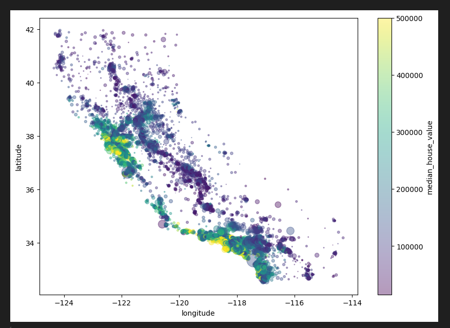
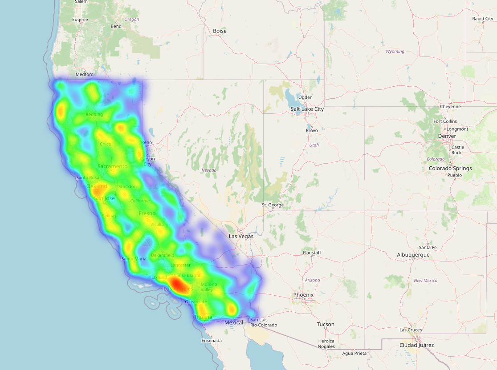
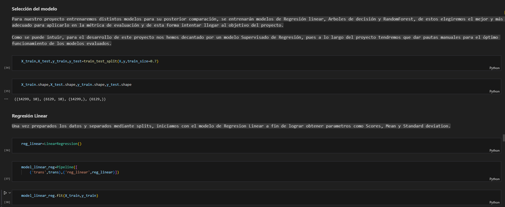
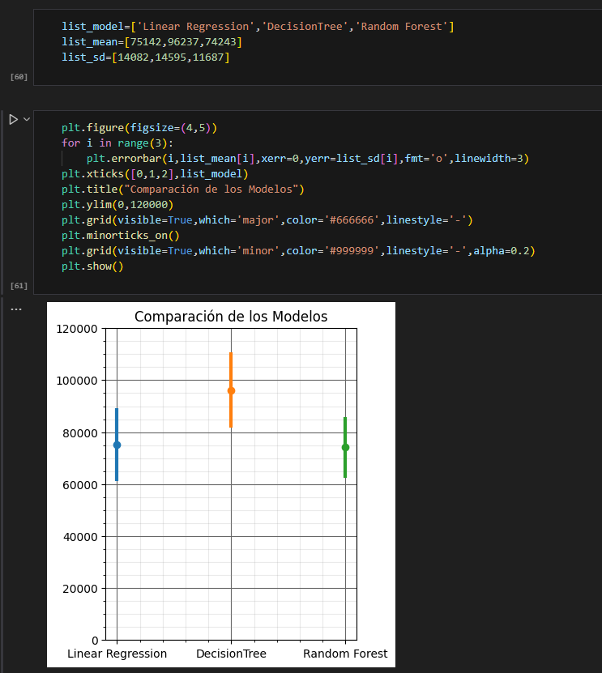

# Housing-Price-Prediction-Data-Analyst

This project focuses on analyzing and predicting housing prices in California using machine learning techniques. It includes data exploration, cleaning, and preparation, along with geospatial visualization to identify key trends and property hotspots. Various models, including Linear Regression, Decision Trees, and Random Forest, were trained and evaluated to determine the most accurate approach for predicting current market prices. Random Forest emerged as the optimal model after fine-tuning, delivering reliable predictions aligned with actual housing prices.
 

